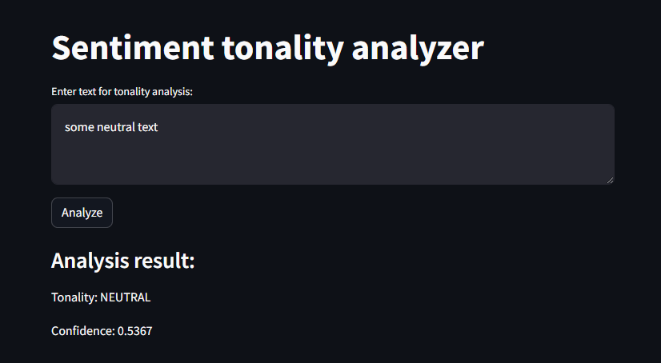

# Sentiment Analysis Web App

https://2cuiacfuyrkl6xvlg9xbob.streamlit.app/

This is a simple web application built with Streamlit that uses the transformers library to analyze the sentiment of input text using a pre-trained sentiment analysis model (blanchefort/rubert-base-cased-sentiment).



## Dependencies

- Transformers (requires tensorflow or pytorch)
- Streamlit

## How to Run

1. **Install dependencies**

2. **Run the app:**

    ```bash
    streamlit run app.py
    ```

3. **Open your web browser and visit [http://localhost:8501](http://localhost:8501) to interact with the app.**

## Usage

1. Enter text in the provided text area.
2. Click the "Analyze" button to see the sentiment analysis results.
